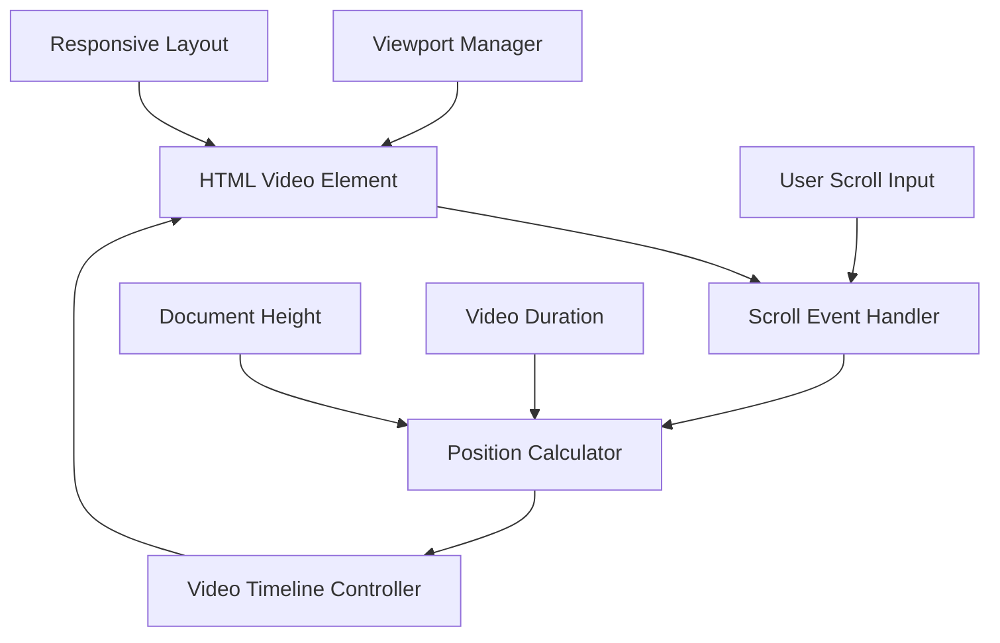
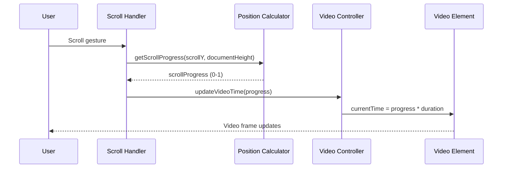
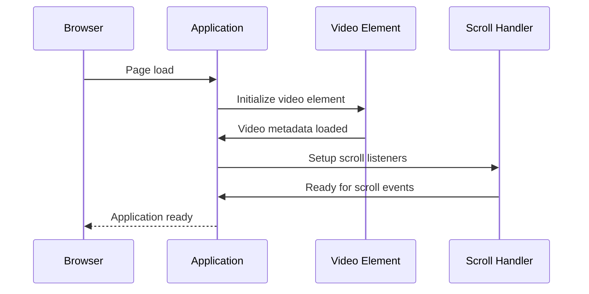

# Design Document: Scroll-Controlled Video Player

## Overview

A scroll-controlled video player that synchronizes video playback with user scroll position, creating an immersive interactive experience. The video remains fixed in the viewport while scrolling down advances the video forward and scrolling up moves it backward, providing frame-by-frame control through scroll gestures.

## Architecture

The system consists of a responsive video player with scroll event handlers that map scroll position to video timeline position, creating a seamless connection between user interaction and video playback.



## Sequence Diagrams

### Main Scroll-to-Video Flow



### Initialization Flow



## Components and Interfaces

### ScrollVideoPlayer Component

**Purpose**: Main component that orchestrates the scroll-controlled video playback

**Interface**:
```typescript
interface ScrollVideoPlayer {
  videoElement: HTMLVideoElement
  scrollContainer: HTMLElement
  
  initialize(): void
  handleScroll(event: Event): void
  updateVideoPosition(progress: number): void
  calculateScrollProgress(): number
  setupResponsiveLayout(): void
}
```

**Responsibilities**:
- Initialize video element and scroll listeners
- Calculate scroll progress and map to video timeline
- Handle responsive layout and viewport management
- Manage video playback state

### PositionCalculator Component

**Purpose**: Calculates the relationship between scroll position and video timeline

**Interface**:
```typescript
interface PositionCalculator {
  getScrollProgress(scrollY: number, documentHeight: number, viewportHeight: number): number
  getVideoTime(progress: number, videoDuration: number): number
  clampProgress(progress: number): number
}
```

**Responsibilities**:
- Convert scroll position to normalized progress (0-1)
- Map progress to video timeline position
- Handle edge cases and bounds checking

### ResponsiveManager Component

**Purpose**: Manages responsive layout and viewport sizing

**Interface**:
```typescript
interface ResponsiveManager {
  setupViewport(): void
  handleResize(): void
  calculateOptimalVideoSize(): { width: number, height: number }
}
```

**Responsibilities**:
- Ensure video fills viewport appropriately
- Handle window resize events
- Maintain aspect ratio and responsive behavior

## Data Models

### VideoState Model

```typescript
interface VideoState {
  duration: number
  currentTime: number
  isLoaded: boolean
  aspectRatio: number
}
```

**Validation Rules**:
- duration must be positive number
- currentTime must be between 0 and duration
- aspectRatio must be positive number

### ScrollState Model

```typescript
interface ScrollState {
  scrollY: number
  documentHeight: number
  viewportHeight: number
  progress: number
}
```

**Validation Rules**:
- scrollY must be non-negative
- documentHeight must be greater than viewportHeight
- progress must be between 0 and 1

## Algorithmic Pseudocode

### Main Scroll Handler Algorithm

```pascal
ALGORITHM handleScrollEvent(event)
INPUT: event of type ScrollEvent
OUTPUT: void (side effect: video time updated)

PRECONDITIONS:
- video element is loaded and has valid duration
- document height is greater than viewport height
- scroll listeners are properly attached

BEGIN
  scrollY ← window.scrollY
  documentHeight ← document.documentElement.scrollHeight
  viewportHeight ← window.innerHeight
  
  // Calculate scroll progress with bounds checking
  maxScroll ← documentHeight - viewportHeight
  
  IF maxScroll ≤ 0 THEN
    progress ← 0
  ELSE
    progress ← scrollY / maxScroll
    progress ← CLAMP(progress, 0, 1)
  END IF
  
  // Map progress to video time
  videoDuration ← videoElement.duration
  targetTime ← progress * videoDuration
  
  // Update video position
  videoElement.currentTime ← targetTime
  
  ASSERT videoElement.currentTime >= 0 AND videoElement.currentTime <= videoDuration
END

POSTCONDITIONS:
- video currentTime reflects scroll position
- progress value is between 0 and 1
- video frame corresponds to scroll position
```

### Responsive Layout Algorithm

```pascal
ALGORITHM setupResponsiveLayout()
INPUT: none
OUTPUT: void (side effect: video element styled)

PRECONDITIONS:
- video element exists in DOM
- viewport dimensions are available

BEGIN
  viewportWidth ← window.innerWidth
  viewportHeight ← window.innerHeight
  
  // Get video natural dimensions
  videoWidth ← videoElement.videoWidth
  videoHeight ← videoElement.videoHeight
  
  IF videoWidth = 0 OR videoHeight = 0 THEN
    // Video not loaded yet, use default aspect ratio
    aspectRatio ← 16 / 9
  ELSE
    aspectRatio ← videoWidth / videoHeight
  END IF
  
  // Calculate optimal size to fill viewport
  IF viewportWidth / viewportHeight > aspectRatio THEN
    // Viewport is wider than video
    displayHeight ← viewportHeight
    displayWidth ← displayHeight * aspectRatio
  ELSE
    // Viewport is taller than video
    displayWidth ← viewportWidth
    displayHeight ← displayWidth / aspectRatio
  END IF
  
  // Apply styles to video element
  videoElement.style.width ← displayWidth + "px"
  videoElement.style.height ← displayHeight + "px"
  videoElement.style.position ← "fixed"
  videoElement.style.top ← "50%"
  videoElement.style.left ← "50%"
  videoElement.style.transform ← "translate(-50%, -50%)"
  
  ASSERT displayWidth > 0 AND displayHeight > 0
END

POSTCONDITIONS:
- video element fills viewport appropriately
- video maintains aspect ratio
- video is centered in viewport
```

## Key Functions with Formal Specifications

### Function 1: calculateScrollProgress()

```typescript
function calculateScrollProgress(): number
```

**Preconditions:**
- `window.scrollY` is defined and non-negative
- `document.documentElement.scrollHeight` is defined and positive
- `window.innerHeight` is defined and positive

**Postconditions:**
- Returns value between 0 and 1 inclusive
- 0 represents top of document, 1 represents bottom
- Function is pure (no side effects)

**Loop Invariants:** N/A (no loops in this function)

### Function 2: updateVideoTime(progress: number)

```typescript
function updateVideoTime(progress: number): void
```

**Preconditions:**
- `progress` is between 0 and 1 inclusive
- `videoElement.duration` is defined and positive
- Video metadata is loaded

**Postconditions:**
- `videoElement.currentTime` equals `progress * videoElement.duration`
- Video displays frame corresponding to calculated time
- No mutations to input parameter

**Loop Invariants:** N/A (no loops in this function)

### Function 3: initializeScrollListener()

```typescript
function initializeScrollListener(): void
```

**Preconditions:**
- Video element exists in DOM
- Video metadata is loaded (duration available)
- Document is ready for event listeners

**Postconditions:**
- Scroll event listener is attached to window
- Resize event listener is attached to window
- Initial video position is set to frame 0
- Responsive layout is applied

**Loop Invariants:** N/A (no loops in this function)

## Example Usage

```typescript
// Example 1: Basic initialization
const videoPlayer = new ScrollVideoPlayer('video-element-id')
videoPlayer.initialize()

// Example 2: With custom configuration
const player = new ScrollVideoPlayer('video-element-id', {
  smoothing: true,
  debounceMs: 16
})

// Example 3: Manual control
const progress = 0.5 // 50% through video
player.updateVideoPosition(progress)

// Example 4: Event handling
window.addEventListener('scroll', (event) => {
  const progress = calculateScrollProgress()
  updateVideoTime(progress)
})
```

## Correctness Properties

*A property is a characteristic or behavior that should hold true across all valid executions of a system-essentially, a formal statement about what the system should do. Properties serve as the bridge between human-readable specifications and machine-verifiable correctness guarantees.*

### Property 1: Progress Bounds

*For any* scroll position, the calculated progress value should be between 0 and 1 inclusive

**Validates: Requirements 6.4**

### Property 2: Video Time Mapping

*For any* progress value between 0 and 1, the video current time should equal progress multiplied by video duration

**Validates: Requirements 6.5**

### Property 3: Monotonic Scroll Relationship

*For any* two scroll positions where the first is less than the second, the video time at the first position should be less than or equal to the video time at the second position

**Validates: Requirements 2.3, 3.2**

### Property 4: Responsive Aspect Ratio Preservation

*For any* viewport dimensions, the video element should maintain its original aspect ratio while fitting within the viewport

**Validates: Requirements 5.2, 5.3**

### Property 5: Fixed Position Invariant

*For any* scroll event, the video element should remain in a fixed position within the viewport

**Validates: Requirements 1.1, 1.3**

### Property 6: Deterministic Frame Display

*For any* scroll position, returning to that same position should always display the identical video frame

**Validates: Requirements 8.1, 8.3**

### Property 7: Linear Progress Mapping

*For any* scroll position, the relationship between scroll progress and video timeline should be linear

**Validates: Requirements 6.3**

### Property 8: Viewport Adaptation

*For any* viewport size change, the video should adapt its dimensions to optimally fill the available space

**Validates: Requirements 5.1, 5.4**

### Property 9: Scroll Direction Correspondence

*For any* downward scroll movement, the video should advance to later frames, and for any upward scroll movement, the video should move to earlier frames

**Validates: Requirements 2.1, 3.1**

### Property 10: Complete Timeline Navigation

*For any* video frame, there should exist a scroll position that displays that frame

**Validates: Requirements 3.3**

## Error Handling

### Error Scenario 1: Video Load Failure

**Condition**: Video file cannot be loaded or is corrupted
**Response**: Display error message and fallback to static image
**Recovery**: Retry loading after network recovery or provide alternative content

### Error Scenario 2: Invalid Scroll Calculations

**Condition**: Document height calculation returns invalid values
**Response**: Use fallback values and disable scroll control temporarily
**Recovery**: Recalculate on next scroll event or window resize

### Error Scenario 3: Performance Degradation

**Condition**: Scroll events fire too frequently causing frame drops
**Response**: Implement debouncing and frame rate limiting
**Recovery**: Reduce update frequency while maintaining smooth experience

## Testing Strategy

### Unit Testing Approach

Test individual functions with various input ranges:
- `calculateScrollProgress()` with edge cases (0, max scroll, negative values)
- `updateVideoTime()` with boundary values (0, 1, invalid progress)
- Responsive layout calculations with different aspect ratios

### Property-Based Testing Approach

**Property Test Library**: fast-check (for TypeScript/JavaScript)

**Key Properties to Test**:
1. **Progress Calculation**: For any valid scroll position, progress is always between 0 and 1
2. **Video Time Mapping**: Video time always corresponds correctly to progress value
3. **Inverse Relationship**: Converting scroll→progress→videoTime→progress should return original progress
4. **Monotonicity**: Increasing scroll position never decreases video time

### Integration Testing Approach

Test complete scroll-to-video pipeline:
- Simulate scroll events and verify video frame updates
- Test responsive behavior across different viewport sizes
- Verify smooth playback during continuous scrolling

## Performance Considerations

- **Debouncing**: Limit scroll event processing to 60fps maximum
- **RAF Optimization**: Use requestAnimationFrame for smooth video updates
- **Memory Management**: Properly cleanup event listeners on component unmount
- **Video Preloading**: Ensure video is fully loaded before enabling scroll control

## Security Considerations

- **Content Security Policy**: Ensure video source is from trusted domain
- **Input Validation**: Sanitize and validate all scroll position calculations
- **Resource Limits**: Prevent excessive memory usage from large video files

## Dependencies

- **Core**: HTML5 Video API, DOM Event API, CSS3 transforms
- **Optional**: Intersection Observer API for performance optimization
- **Browser Support**: Modern browsers with HTML5 video support
- **File Requirements**: MP4 video file in Public directory